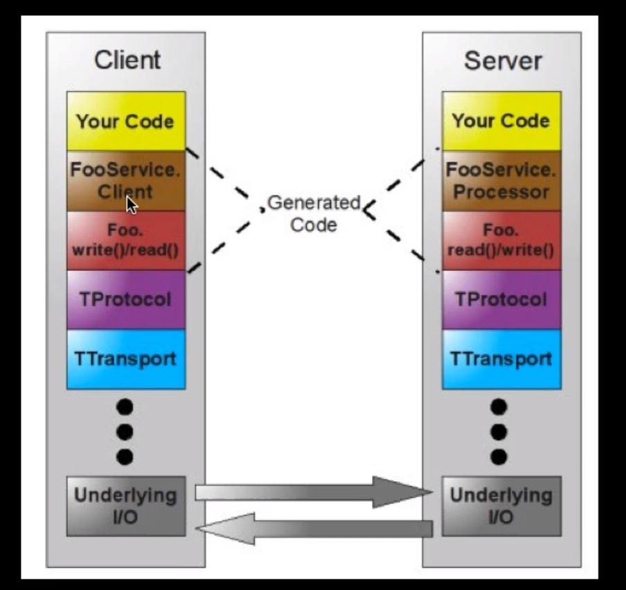

## Chapter01 - Netty简单使用
### 1.初识 Netty 服务端编码

### 2.Netty 对 Socket 的支持
     Socket 的支持
     类比记忆：
     NioServerSocketChannel -> ServerSocket
     NioSocketChannel -> Socket
     测试：启动服务器与客户端
     
### 3.Netty 实现的简易聊天程序
     简易聊天程序：
     
     测试：
     服务器启动 -> 客户端1建立连接、客户端2建立连接....
     客户端上线通知其他客户端xxx上线
     某一个客户端发送消息 -> 其余客户端收到xxx的消息，自己显示[自己] ->群发
     
### 4.Netty 的心跳支持
    心跳机制 - IdleStateHandler
    
### 5.Netty 对 WebSocket 的支持
     对 WebSocket 的支持
     基于 HTTP，需要http编解码器
     	- HttpServerCodec
      - ChunkedWriteHandler  块
      - HttpObjectAggregator 聚合
     websocket的编解码器
      - WebSocketServerProtocolHandler
     
     websocket的消息类型：WebSocketFrame
     	- BinaryWebSocketFrame
     	- TextWebSocketFrame
     	- ContinuationWebSocketFrame
     	- PingWebSocketFrame
     	- PongWebSocketFrame
     	- CloseWebSocketFrame
     	

## chapter02 - Google-protobuf （Protocol Buffers）
### 1.protobuf 的使用
   [ProtoBuf](https://github.com/google/protobuf)
   
    rmi：remote method invocation，只针对 Java
    client: stub
    server: skeleton
    序列化与反序列化，也叫做：编码与解码
    
    RPC：Remote Procedure Call，远程过程调用，很多 RPC 框架是跨语言的
    1.定义一个接口说明文件（idl）：描述了对象（结构体）、对象成员、接口方法等一系列信息
    2.通过 RPC 框架锁提供的编译器，将接口说明文件编译成具体语言文件
    3.在客户端与服务器端分别引入 RPC 编译器所生成的文件，即可像调用本地方法一样调用远程方法
    
    依赖引入：
        compile 'com.google.protobuf:protobuf-java:3.11.0'
        compile 'com.google.protobuf:protobuf-java-util:3.11.0'
    
#### 1.1 操作步骤 [参考](https://developers.google.com/protocol-buffers/)
   1、创建 .proto 描述文件
  ```text
syntax = "proto2";

package com.shadow.netty.chapter02;

option optimize_for = SPEED;
option java_package = "com.shadow.netty.chapter02";
option java_outer_classname = "DataInfo";

message Student {
    required string name = 1;
    optional int32 age = 2;
    optional string address = 3;
}

```
   2、执行 
  ```javascript
   protoc --java_out=src\main\java  src\protobuf\Student.proto        
```
    
   3、API 调用
  ```java
public class ProtoBufTest {
	public static void main(String[] args) throws InvalidProtocolBufferException {

		DataInfo.Student student = DataInfo.Student.newBuilder()
				.setName("张三").setAge(18).setAddress("深圳").build();

		byte[] bytes = student.toByteArray();

		DataInfo.Student student1 = DataInfo.Student.parseFrom(bytes);

		System.out.println(student1.getName());
		System.out.println(student1.getAge());
		System.out.println(student1.getAddress());

	}
}
```

### 2.protobuf 的使用及如何支持通用的数据类型 
     
   1、Protobuf 编解码器：（注意addLast顺序）
      
      - ProtobufVarint32FrameDecoder
      - ProtobufDecoder
      - ProtobufVarint32LengthFieldPrepender
      - ProtobufEncoder
     
   2、如何使其支持多数据类型进行处理？
     
    ①、自定义协议（Netty官方示例）
    ②、规范IDL消息定义方式（消息枚举）oneof 的使用
   ```java
syntax = "proto2";

package com.shadow.netty.chapter02;
option optimize_for = SPEED;
option java_package = "com.shadow.netty.chapter02";
option java_outer_classname = "GeneralMessage";

message Message {
    enum DataType {
        PersonType = 1;
        DogType = 2;
        CatType = 3;
    }
    required DataType date_type = 1;
    oneof dataBody {
        Person person = 2;
        Dog dog = 3;
        Cat cat = 4;
    }

}

message Person {
    optional string name = 1;
    optional int32 age = 2;
    optional string address = 3;
}

message Dog {
    optional string name = 1;
    optional int32 age = 2;
}

message Cat {
    optional string name = 1;
    optional string city = 2;
}
```

   3. 关于如何对生成的java文件共享
   
    ① jar包（带版本）
    ② git subtree
    ③ git submodule（不怎么使用）
    

## chapter03 - Apache thrift
### 1.[官网](http://thrift.apache.org/)

    1、下载 exe 文件，添加到 path
    2、执行命令 thrift --gen java data.thrift
    3、引入依赖包  compile 'org.apache.thrift:libthrift:0.13.0'
    
  
  
  Thrift 传输格式：
  
    1、TBinaryProtocol ：二进制格式 *
    2、TCompactProtocol ：压缩格式 *
    3、TJSONProtocol ： JSON格式
    4、TSimpleJSONProtocol ： 提供JSON只写协议，生成的文件很容易通过脚本语言解析，极少使用
    5、TDebugProtocol ： 使用易懂的可读的文本格式，以便于debug

  Thrift 数据传输方式：
  
    1、TSocket ： 阻塞式 socket 较少使用
    2、TFramedTransport ： 以 frame为单位解析传输，非阻塞式服务中使用 *
    3、TFileTransport ： 以文件形式解析传输
    4、TMemoryTransport ： 将内存用于I/O，Java实现时内部实际使用了简单的 ByteArrayOutputStream
    5、TZlibTransport ： 使用zlib进行压缩，与其他传输方式联合使用，当前无Java实现

  Thrift 支持的服务模型：
  
    1、TSimpleServer ： 简单的单线程服务模型，常用于测试
    2、TThreadPoolServer ： 多线程服务模型，使用标准的阻塞式IO
    3、TNonblockingServer ：多线程服务模型，使用费阻塞式IO（需使用TFramedTransport数据传输方式）
    4、THsHaSerer ：THsHa引入了线程池去处理，其模型把读写任务放到线程池去处理；Half-sync/Half-async的处理模式
                  Half-async是在处理IO事件上（accept/read/write IO），Half-sync用于handler对rpc的同步处理
                  
      
### 2.多语言 - python 演示
   1、生成 py 文件命令：thrift --gen py data.thrift
   
   2、编写 python 代码
     - 下载 thrift-0.13.0.tar.gz 解压缩 - lib/py/setup.py
     
   - 实现类
   ```python
   # _*_ coding:utf-8 _*_
   __author__ = 'shadow'
   
   
   from py.com.shadow.netty import ttypes
   
   class PersonServiceImpl:
       def getPersonByUsername(self,username):
           print("请求参数", username)
   
           person = ttypes.Person()
           person.username = username
           person.age = 20
           person.married = True
           return person
   
       def savePerson(self, person):
           print("获取到保存数据")
           print(person.username)
           print(person.age)
           print(person.married)
   ```
    
   - PythonThriftServer
   ```python
   # _*_ coding:utf-8 _*_
   __author__ = 'shadow'
   
   from thrift import Thrift
   from py.com.shadow.netty import PersonService
   from PersonServiceImpl import PersonServiceImpl
   from thrift.transport import TTransport
   from thrift.transport import TSocket
   from thrift.protocol import TCompactProtocol
   from thrift.server import TServer
   
   try:
       personServiceHandler = PersonServiceImpl()
       processor = PersonService.Processor(personServiceHandler)
   
       serverSocket = TSocket.TServerSocket(host="127.0.0.1",port=8899)
       transportFactory = TTransport.TFramedTransportFactory()
       protocolFactory = TCompactProtocol.TCompactProtocolFactory()
   
       server = TServer.TSimpleServer(processor, serverSocket, transportFactory, protocolFactory)
       server.serve()
   
   except Thrift.TException as tx:
       print(tx.message)

   ```
   - PythonThriftClient
   ```python
   # _*_ coding:utf-8 _*_
   __author__ = 'shadow'
   
   from py.com.shadow.netty import PersonService
   from py.com.shadow.netty import ttypes
   
   from thrift import Thrift
   from thrift.transport import TTransport
   from thrift.transport import TSocket
   from thrift.protocol import TCompactProtocol
   
   try:
       tSocket = TSocket.TSocket('localhost', 8899)
       tSocket.setTimeout(600)
   
       transport = TTransport.TFramedTransport(tSocket)
       protocol = TCompactProtocol.TCompactProtocol(transport)
       client = PersonService.Client(protocol)
   
   
       transport.open()
   
       person = client.getPersonByUsername("张三")
   
       print(person.username)
       print(person.age)
       print(person.married)
   
       print('--------------')
   
       newPerson = ttypes.Person()
       newPerson.username = "jack"
       newPerson.age = 18
       newPerson.married = False
       client.savePerson(newPerson)
   
       transport.close()
   
   except Thrift.TException as tx:
       print(tx.message)

   ```
  - 可结合 Java 服务端、客户端进行联合测试
    
    
## chapter04 - gRpc 
### 1.gRPC lets you define four kinds of service method

    - rpc SayHello(HelloRequest) returns (HelloResponse);
    - rpc LotsOfReplies(HelloRequest) returns (stream HelloResponse);
    - rpc LotsOfGreetings(stream HelloRequest) returns (HelloResponse);
    - rpc BidiHello(stream HelloRequest) returns (stream HelloResponse);
    
    请求和响应都必须是 message 类型的，即（HelloRequest、HelloResponse）必须是 message类型
    
   ```text
service HelloService {
  rpc SayHello (HelloRequest) returns (HelloResponse);
}

message HelloRequest {
  string greeting = 1;
}

message HelloResponse {
  string reply = 1;
}
```
### 2.实例 Student.proto
  1、编写 IDL 文件
  ```text
syntax = "proto3";

package com.shadow.netty.chapter04;

option java_package = "com.shadow.netty.chapter04";
option java_outer_classname = "StudentProto";
option java_multiple_files = true;

service StudentService {
    rpc GetRealNameByUsername(MyRequest) returns (MyResponse) {}
}

message MyRequest {
    string username = 1;
}

message MyResponse {
    string realname = 2;
}
```
  2、编译命令：gradle clean generateProto
     - 自动寻找 src/main/proto下的.proto文件,生成文件位置 build/generated/... 文件夹下

  3、编写实现类
  ```java
public class StudentServiceImpl extends StudentServiceGrpc.StudentServiceImplBase {
	@Override
	public void getRealNameByUsername(MyRequest request, StreamObserver<MyResponse> responseObserver) {
		System.out.println("接收到客户端消息：" + request.getUsername());

		// 返回数据
		responseObserver.onNext(MyResponse.newBuilder().setRealname("shadow").build());
		responseObserver.onCompleted();
	}
}
```

  4、编写服务端
  ```java
public class GrpcServer {

	private Server server;

	public static void main(String[] args) throws InterruptedException, IOException {
		GrpcServer grpcServer = new GrpcServer();

		grpcServer.start();
		grpcServer.awaitTerminated();

	}

	private void start() throws IOException {
		this.server = ServerBuilder.forPort(8899).addService(new StudentServiceImpl()).build().start();
		System.out.println("server started");

		// 异步方法
		Runtime.getRuntime().addShutdownHook(new Thread(() ->{
			System.out.println("shutdown jvm");
			GrpcServer.this.stop();
		}));
	}

	private void stop() {
		if(null != this.server) this.server.shutdown();
	}


	private void awaitTerminated() throws InterruptedException {
		if(null != this.server) this.server.awaitTermination();
	}
}
```
  5、编写客户端
  ```java
public class GrpcClient {
	public static void main(String[] args) {

		ManagedChannel managedChannel = ManagedChannelBuilder.forAddress("localhost", 8899)
				.usePlaintext().build();

		StudentServiceGrpc.StudentServiceBlockingStub blockingStub = StudentServiceGrpc.newBlockingStub(managedChannel);
		MyResponse response = blockingStub.getRealNameByUsername(MyRequest.newBuilder().setUsername("李四").build());

		System.out.println(response.getRealname());
	}
}
```


