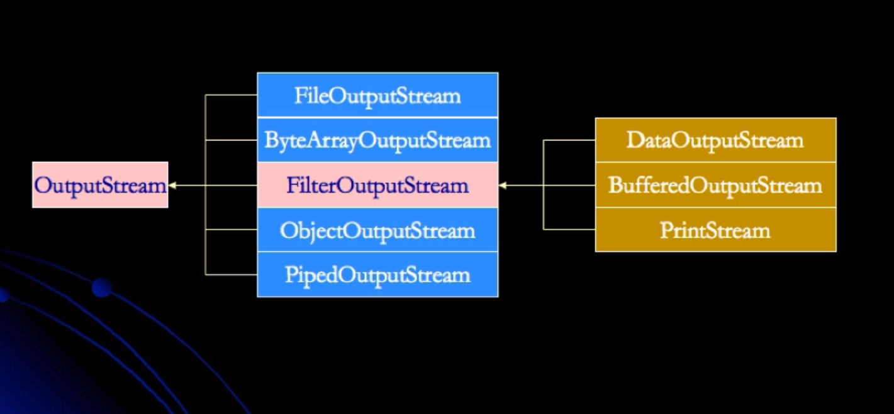

## Chapter01 - Netty简单使用
### 1.初识 Netty 服务端编码
```java
/**
 * @author shadow
 * @create 2020-09-28
 * @description
 *
 *  HTTP 服务器
 *
 * 测试：curl "http://localhost:8080"
 */
public class NettyServer01 {
	public static void main(String[] args) {
		// 事件循环组
		// bossGroup 接收连接不处理请求，将请求转发给 workGroup
		EventLoopGroup bossGroup = new NioEventLoopGroup(1);// 多线程模式
		EventLoopGroup workGroup = new NioEventLoopGroup(Runtime.getRuntime().availableProcessors());

		// 服务端启动器
		ServerBootstrap serverBootstrap = new ServerBootstrap();
		serverBootstrap.group(bossGroup, workGroup)
				.channel(NioServerSocketChannel.class)
				.childHandler(new MyNettyServer01ChannelInitializer()); // 通道初始化器

		try {
			// 绑定ip端口
			ChannelFuture channelFuture = serverBootstrap.bind("localhost", 8080).sync();
			channelFuture.channel().closeFuture().sync();
		} catch (InterruptedException e) {
			e.printStackTrace();
		}finally {
			// 优雅关闭
			bossGroup.shutdownGracefully();
			workGroup.shutdownGracefully();
		}
	}

	static class MyNettyServer01ChannelInitializer extends ChannelInitializer<SocketChannel> {

		@Override
		protected void initChannel(SocketChannel ch) throws Exception {
			ChannelPipeline pipeline = ch.pipeline();
						// HttpServerCodec 编解码通道处理器 HttpRequestDecoder、HttpResponseEncoder的合并
			pipeline.addLast("httpServerCodec",new HttpServerCodec())
						// StringEncoder、StringDecoder字符串编解码处理器
					.addLast("stringDec",new StringDecoder())
					.addLast(new StringEncoder())
						// 业务处理 handler
					.addLast("httpHandler",new MyNettyServer01ChannelInBuoundHandler());
		}
	}

	// ChannelInboundHandlerAdapter 子类  SimpleChannelInboundHandler
	static class MyNettyServer01ChannelInBuoundHandler extends SimpleChannelInboundHandler<HttpObject> {

		@Override
		protected void channelRead0(ChannelHandlerContext ctx, HttpObject msg) throws Exception {
			// msg 类型
			System.out.println(msg.getClass());
			// 远程通道地址
			System.out.println(ctx.channel().remoteAddress());
			// 可进行查看 remote address
			Thread.sleep(8000);

			if(msg instanceof HttpRequest) {
				HttpRequest httpRequest = (HttpRequest)msg;

				System.out.println("请求方法名：" + httpRequest.method().name());

				URI uri = new URI(httpRequest.uri());
				if("/favicon.ico".equals(uri.getPath())) {
					System.out.println(uri.getPath());
				}
				ByteBuf content = Unpooled.copiedBuffer("Hello World ~",CharsetUtil.UTF_8);
				FullHttpResponse response = new DefaultFullHttpResponse(HttpVersion.HTTP_1_1
						, HttpResponseStatus.OK, content);
				response.headers().set(HttpHeaderNames.CONTENT_TYPE,"text/plain");
				response.headers().set(HttpHeaderNames.CONTENT_LENGTH,content.readableBytes());
				// 写回响应
				ctx.writeAndFlush(response);
				// 关闭通道 - 服务端主动关闭（可根据连接的保持时间来定时关闭）
				ctx.channel().close();
			}
		}

		// 3.active
		@Override
		public void channelActive(ChannelHandlerContext ctx) throws Exception {
			System.out.println("channel active");
			super.channelActive(ctx);
		}

		// 2.registered
		@Override
		public void channelRegistered(ChannelHandlerContext ctx) throws Exception {
			System.out.println("channel registered");
			super.channelRegistered(ctx);
		}

		// 1.added
		@Override
		public void handlerAdded(ChannelHandlerContext ctx) throws Exception {
			System.out.println("handler added");
			super.handlerAdded(ctx);
		}

		// 4.inActive
		@Override
		public void channelInactive(ChannelHandlerContext ctx) throws Exception {
			System.out.println("channel inActive");
			super.channelInactive(ctx);
		}

		// 5.unRegistered
		@Override
		public void channelUnregistered(ChannelHandlerContext ctx) throws Exception {
			System.out.println("channel unRegistered");
			super.channelUnregistered(ctx);
		}
	}
}
```
### 2.Netty 对 Socket 的支持
```java
/**
 * @author shadow
 * @create 2020-09-29
 * @description
 *
 * Socket 的支持
 * 类比记忆：
 * NioServerSocketChannel -> ServerSocket
 * NioSocketChannel -> Socket
 * 测试：启动服务器与客户端
 *
 */
public class NettyServer02 {
	public static void main(String[] args) {
		EventLoopGroup bossGroup = new NioEventLoopGroup();
		EventLoopGroup workGroup = new NioEventLoopGroup();

		ServerBootstrap serverBootstrap = new ServerBootstrap();
		serverBootstrap.group(bossGroup, workGroup)
				.channel(NioServerSocketChannel.class) // 类比 ServerSocket
				.handler(new LoggingHandler()) // bossGroup 的 handler
				.childHandler(new MyNettyServer02ChannelInitializer());
		try {
			ChannelFuture channelFuture = serverBootstrap.bind("localhost", 8090).sync();
			channelFuture.channel().closeFuture().sync();
		} catch (InterruptedException e) {
			e.printStackTrace();
		} finally {
			bossGroup.shutdownGracefully();
			workGroup.shutdownGracefully();
		}
	}

	static class MyNettyServer02ChannelInitializer extends ChannelInitializer<SocketChannel> {
		@Override
		protected void initChannel(SocketChannel ch) throws Exception {
			ChannelPipeline pipeline = ch.pipeline();
			pipeline.addLast(new LengthFieldBasedFrameDecoder(Integer.MAX_VALUE,0,4,0,4))
					.addLast(new LengthFieldPrepender(4))
					.addLast(new StringEncoder(CharsetUtil.UTF_8))
					.addLast(new StringDecoder(CharsetUtil.UTF_8))
					.addLast("myHandler",new MyNettyServer02ChannelInBoundHandler());
		}
	}

	static class MyNettyServer02ChannelInBoundHandler extends SimpleChannelInboundHandler<String> {
		@Override
		protected void channelRead0(ChannelHandlerContext ctx, String msg) throws Exception {
			// 接收到客户端发送的数据
			System.out.println(ctx.channel().remoteAddress() + "," + msg);
			// 返回客户端数据
			ctx.writeAndFlush("from server : " + UUID.randomUUID());
		}

		// 异常处理
		@Override
		public void exceptionCaught(ChannelHandlerContext ctx, Throwable cause) throws Exception {
			cause.printStackTrace();
			ctx.close();
		}
	}
}
```
     
### 3.Netty 实现的简易聊天程序
```java
/**
 * @author shadow
 * @create 2020-09-29
 * @description
 *
 * 简易聊天程序：
 *
 * 测试：
 * 服务器启动 -> 客户端1建立连接、客户端2建立连接....
 * 客户端上线通知其他客户端xxx上线
 * 某一个客户端发送消息 -> 其余客户端收到xxx的消息，自己显示[自己] ->群发
 *
 */
public class NettyServer03 {
	public static void main(String[] args) {
		EventLoopGroup bossGroup = new NioEventLoopGroup();
		EventLoopGroup workGroup = new NioEventLoopGroup();

		ServerBootstrap serverBootstrap = new ServerBootstrap();
		serverBootstrap.group(bossGroup, workGroup)
				.channel(NioServerSocketChannel.class)
				.childHandler(new MyNettyServer03ChannelInitializer());
		try {
			ChannelFuture channelFuture = serverBootstrap.bind("localhost", 8090).sync();
			channelFuture.channel().closeFuture().sync();
		} catch (InterruptedException e) {
			e.printStackTrace();
		} finally {
			bossGroup.shutdownGracefully();
			workGroup.shutdownGracefully();
		}
	}

	static class MyNettyServer03ChannelInitializer extends ChannelInitializer<SocketChannel> {
		@Override
		protected void initChannel(SocketChannel ch) throws Exception {
			ChannelPipeline pipeline = ch.pipeline();
			pipeline.addLast(new DelimiterBasedFrameDecoder(4096,Delimiters.lineDelimiter()))
					.addLast(new StringDecoder(CharsetUtil.UTF_8))
					.addLast(new StringEncoder(CharsetUtil.UTF_8))
					.addLast(new MyNettyServer03ChannelInBoundHandler());
		}
	}

	static class MyNettyServer03ChannelInBoundHandler extends SimpleChannelInboundHandler<String> {
		// 存储所有客户端
		private static ChannelGroup channelGroup = new DefaultChannelGroup(GlobalEventExecutor.INSTANCE);

		// 客户端建立连接后 -> 广播xxx加入消息
		@Override
		public void handlerAdded(ChannelHandlerContext ctx) throws Exception {
			Channel channel = ctx.channel();
			// 通知其他客户端
			channelGroup.writeAndFlush("【服务器】- "+ channel.remoteAddress() + " 加入\n");
			// 添加自己
			channelGroup.add(channel);
		}

		// 接收到客户端的消息 -> 广播发送消息
		@Override
		protected void channelRead0(ChannelHandlerContext ctx, String msg) throws Exception {
			Channel channel = ctx.channel();
			channelGroup.forEach(ch -> {
				if(channel != ch) {
					ch.writeAndFlush(channel.remoteAddress() + " 发送的消息：" + msg + "\n");
				}else {
					ch.writeAndFlush("【自己】 " + msg + "\n");
				}
			});
		}

		@Override
		public void channelActive(ChannelHandlerContext ctx) throws Exception {
			Channel channel = ctx.channel();
			System.out.println(channel.remoteAddress() + " 上线");
		}

		@Override
		public void channelInactive(ChannelHandlerContext ctx) throws Exception {
			Channel channel = ctx.channel();
			System.out.println(channel.remoteAddress() + " 下线");
		}

		// 客户端移除 -> 广播消息xxx离开
		@Override
		public void handlerRemoved(ChannelHandlerContext ctx) throws Exception {
			Channel channel = ctx.channel();
			// channelGroup.remove(channel); 这里 ChannelGroup 会自动移除，调用当然也没问题
			System.out.println(channelGroup.size()); // 验证自动移除
			channelGroup.writeAndFlush("【服务器】- " + channel.remoteAddress() + "离开\n");
		}

		@Override
		public void exceptionCaught(ChannelHandlerContext ctx, Throwable cause) throws Exception {
			ctx.close();
		}
	}
}
```
     
### 4.Netty 的心跳支持
```java
/**
 * @author shadow
 * @create 2020-09-29
 * @description
 *
 * 心跳机制 - IdleStateHandler
 */
public class NettyServer04 {
	public static void main(String[] args) {
		EventLoopGroup bossGroup = new NioEventLoopGroup();
		EventLoopGroup workGroup = new NioEventLoopGroup();

		ServerBootstrap serverBootstrap = new ServerBootstrap();
		serverBootstrap.group(bossGroup, workGroup)
				.channel(NioServerSocketChannel.class)
				.handler(new LoggingHandler(LogLevel.INFO)) // bossGroup 的 handler
				.childHandler(new MyNettyServer04ChannelInitializer());
		try {
			ChannelFuture channelFuture = serverBootstrap.bind("localhost", 8090).sync();
			channelFuture.channel().closeFuture().sync();
		} catch (InterruptedException e) {
			e.printStackTrace();
		} finally {
			bossGroup.shutdownGracefully();
			workGroup.shutdownGracefully();
		}
	}

	static class MyNettyServer04ChannelInitializer extends ChannelInitializer<SocketChannel> {
		@Override
		protected void initChannel(SocketChannel ch) throws Exception {
			ChannelPipeline pipeline = ch.pipeline();
			pipeline.addLast(new IdleStateHandler(5,7,10,TimeUnit.SECONDS)) //(读时间,写时间,读写时间) 空闲检测 handler(没有读写的情况下触发事件)
					.addLast(new MyNettyServer04ChannelInBoundHandler());
		}
	}

	static class MyNettyServer04ChannelInBoundHandler extends ChannelInboundHandlerAdapter {
		// 事件触发
		@Override
		public void userEventTriggered(ChannelHandlerContext ctx, Object evt) throws Exception {
			if(evt instanceof IdleStateEvent) {
				IdleStateEvent idleStateEvent = (IdleStateEvent) evt;

				String eventType = "";

				switch (idleStateEvent.state()) {
					case READER_IDLE:
						eventType = "读空闲";
						break;
					case WRITER_IDLE:
						eventType = "写空闲";
						break;
					case ALL_IDLE:
						eventType = "读写空闲";
						break;
				}
				System.out.println(ctx.channel().remoteAddress() + "超时事件：" + eventType);
				ctx.close();
			}
		}
	}
}
```
    
### 5.Netty 对 WebSocket 的支持
     对 WebSocket 的支持
     
     基于 HTTP，需要http编解码器
      - HttpServerCodec
      - ChunkedWriteHandler  块
      - HttpObjectAggregator 聚合
      
     websocket的编解码器
      - WebSocketServerProtocolHandler
     
     websocket的消息类型：WebSocketFrame
     	- BinaryWebSocketFrame
     	- TextWebSocketFrame
     	- ContinuationWebSocketFrame
     	- PingWebSocketFrame
     	- PongWebSocketFrame
     	- CloseWebSocketFrame
```java
public class NettyServer05 {
	public static void main(String[] args) {
		EventLoopGroup bossGroup = new NioEventLoopGroup();
		EventLoopGroup workGroup = new NioEventLoopGroup();

		ServerBootstrap serverBootstrap = new ServerBootstrap();
		serverBootstrap.group(bossGroup, workGroup)
				.channel(NioServerSocketChannel.class)
				.handler(new LoggingHandler(LogLevel.INFO))
				.childHandler(new MyNettyServer05Initializer());
		try {
			ChannelFuture channelFuture = serverBootstrap.bind("localhost", 8090).sync();
			channelFuture.channel().closeFuture().sync();
		} catch (InterruptedException e) {
			e.printStackTrace();
		} finally {
			bossGroup.shutdownGracefully();
			workGroup.shutdownGracefully();
		}
	}

	static class MyNettyServer05Initializer extends ChannelInitializer<SocketChannel> {
		@Override
		protected void initChannel(SocketChannel ch) throws Exception {
			ChannelPipeline pipeline = ch.pipeline();
			pipeline.addLast(new HttpServerCodec())
					.addLast(new ChunkedWriteHandler())
					.addLast(new HttpObjectAggregator(8192))
					.addLast(new WebSocketServerProtocolHandler("/ws"))
					.addLast(new MyNettyServer05ChannelInBoundHandler());
		}
	}

	static class MyNettyServer05ChannelInBoundHandler extends SimpleChannelInboundHandler<TextWebSocketFrame> {
		@Override
		protected void channelRead0(ChannelHandlerContext ctx, TextWebSocketFrame msg) throws Exception {
			// 打印消息
			System.out.println("收到消息:" + msg.text());
			// 写回消息
			ctx.writeAndFlush(new TextWebSocketFrame("websocket message：服务器时间" + LocalDateTime.now()));
		}

		@Override
		public void handlerAdded(ChannelHandlerContext ctx) throws Exception {
			System.out.println("handler added: " + ctx.channel().id().asLongText());
		}

		@Override
		public void handlerRemoved(ChannelHandlerContext ctx) throws Exception {
			System.out.println("handler removed: " + ctx.channel().id().asLongText());
		}

		@Override
		public void exceptionCaught(ChannelHandlerContext ctx, Throwable cause) throws Exception {
			ctx.close();
		}
	}
}
```

## chapter02 - Google-protobuf （Protocol Buffers）
### 1.protobuf 的使用
   [ProtoBuf](https://github.com/google/protobuf)
   
    rmi：remote method invocation，只针对 Java
    client: stub
    server: skeleton
    序列化与反序列化，也叫做：编码与解码
    
    RPC：Remote Procedure Call，远程过程调用，很多 RPC 框架是跨语言的
    1.定义一个接口说明文件（idl）：描述了对象（结构体）、对象成员、接口方法等一系列信息
    2.通过 RPC 框架锁提供的编译器，将接口说明文件编译成具体语言文件
    3.在客户端与服务器端分别引入 RPC 编译器所生成的文件，即可像调用本地方法一样调用远程方法
    
    依赖引入：
        compile 'com.google.protobuf:protobuf-java:3.11.0'
        compile 'com.google.protobuf:protobuf-java-util:3.11.0'
    
#### 1.1 操作步骤 [参考](https://developers.google.com/protocol-buffers/)
   1、创建 .proto 描述文件
  ```text
syntax = "proto2";

package com.shadow.netty.chapter02;

option optimize_for = SPEED;
option java_package = "com.shadow.netty.chapter02";
option java_outer_classname = "DataInfo";

message Student {
    required string name = 1;
    optional int32 age = 2;
    optional string address = 3;
}

```
   2、执行 
  ```javascript
   protoc --java_out=src\main\java  src\protobuf\Student.proto        
```
    
   3、API 调用
  ```java
public class ProtoBufTest {
	public static void main(String[] args) throws InvalidProtocolBufferException {

		DataInfo.Student student = DataInfo.Student.newBuilder()
				.setName("张三").setAge(18).setAddress("深圳").build();

		byte[] bytes = student.toByteArray();

		DataInfo.Student student1 = DataInfo.Student.parseFrom(bytes);

		System.out.println(student1.getName());
		System.out.println(student1.getAge());
		System.out.println(student1.getAddress());

	}
}
```

### 2.protobuf 的使用及如何支持通用的数据类型 
     
   1、Protobuf 编解码器：（注意addLast顺序）
      
      - ProtobufVarint32FrameDecoder
      - ProtobufDecoder
      - ProtobufVarint32LengthFieldPrepender
      - ProtobufEncoder
     
   2、如何使其支持多数据类型进行处理？
     
    ①、自定义协议（Netty官方示例）
    ②、规范IDL消息定义方式（消息枚举）oneof 的使用
   ```java
syntax = "proto2";

package com.shadow.netty.chapter02;
option optimize_for = SPEED;
option java_package = "com.shadow.netty.chapter02";
option java_outer_classname = "GeneralMessage";

message Message {
    enum DataType {
        PersonType = 1;
        DogType = 2;
        CatType = 3;
    }
    required DataType date_type = 1;
    oneof dataBody {
        Person person = 2;
        Dog dog = 3;
        Cat cat = 4;
    }

}

message Person {
    optional string name = 1;
    optional int32 age = 2;
    optional string address = 3;
}

message Dog {
    optional string name = 1;
    optional int32 age = 2;
}

message Cat {
    optional string name = 1;
    optional string city = 2;
}
```

   3. 关于如何对生成的java文件共享
   
    ① jar包（带版本）
    ② git subtree
    ③ git submodule（不怎么使用）
    

## chapter03 - Apache thrift
### 1.[官网](http://thrift.apache.org/)

    1、下载 exe 文件，添加到 path
    2、执行命令 thrift --gen java data.thrift
    3、引入依赖包  compile 'org.apache.thrift:libthrift:0.13.0'
    
  
  
  Thrift 传输格式：
  
    1、TBinaryProtocol ：二进制格式 *
    2、TCompactProtocol ：压缩格式 *
    3、TJSONProtocol ： JSON格式
    4、TSimpleJSONProtocol ： 提供JSON只写协议，生成的文件很容易通过脚本语言解析，极少使用
    5、TDebugProtocol ： 使用易懂的可读的文本格式，以便于debug

  Thrift 数据传输方式：
  
    1、TSocket ： 阻塞式 socket 较少使用
    2、TFramedTransport ： 以 frame为单位解析传输，非阻塞式服务中使用 *
    3、TFileTransport ： 以文件形式解析传输
    4、TMemoryTransport ： 将内存用于I/O，Java实现时内部实际使用了简单的 ByteArrayOutputStream
    5、TZlibTransport ： 使用zlib进行压缩，与其他传输方式联合使用，当前无Java实现

  Thrift 支持的服务模型：
  
    1、TSimpleServer ： 简单的单线程服务模型，常用于测试
    2、TThreadPoolServer ： 多线程服务模型，使用标准的阻塞式IO
    3、TNonblockingServer ：多线程服务模型，使用费阻塞式IO（需使用TFramedTransport数据传输方式）
    4、THsHaSerer ：THsHa引入了线程池去处理，其模型把读写任务放到线程池去处理；Half-sync/Half-async的处理模式
                  Half-async是在处理IO事件上（accept/read/write IO），Half-sync用于handler对rpc的同步处理
                  
      
### 2.多语言 - python 演示
   1、生成 py 文件命令：thrift --gen py data.thrift
   
   2、编写 python 代码
     - 下载 thrift-0.13.0.tar.gz 解压缩 - lib/py/setup.py
     
   - 实现类
   ```python
   # _*_ coding:utf-8 _*_
   __author__ = 'shadow'
   
   
   from py.com.shadow.netty import ttypes
   
   class PersonServiceImpl:
       def getPersonByUsername(self,username):
           print("请求参数", username)
   
           person = ttypes.Person()
           person.username = username
           person.age = 20
           person.married = True
           return person
   
       def savePerson(self, person):
           print("获取到保存数据")
           print(person.username)
           print(person.age)
           print(person.married)
   ```
    
   - PythonThriftServer
   ```python
   # _*_ coding:utf-8 _*_
   __author__ = 'shadow'
   
   from thrift import Thrift
   from py.com.shadow.netty import PersonService
   from PersonServiceImpl import PersonServiceImpl
   from thrift.transport import TTransport
   from thrift.transport import TSocket
   from thrift.protocol import TCompactProtocol
   from thrift.server import TServer
   
   try:
       personServiceHandler = PersonServiceImpl()
       processor = PersonService.Processor(personServiceHandler)
   
       serverSocket = TSocket.TServerSocket(host="127.0.0.1",port=8899)
       transportFactory = TTransport.TFramedTransportFactory()
       protocolFactory = TCompactProtocol.TCompactProtocolFactory()
   
       server = TServer.TSimpleServer(processor, serverSocket, transportFactory, protocolFactory)
       server.serve()
   
   except Thrift.TException as tx:
       print(tx.message)

   ```
   - PythonThriftClient
   ```python
   # _*_ coding:utf-8 _*_
   __author__ = 'shadow'
   
   from py.com.shadow.netty import PersonService
   from py.com.shadow.netty import ttypes
   
   from thrift import Thrift
   from thrift.transport import TTransport
   from thrift.transport import TSocket
   from thrift.protocol import TCompactProtocol
   
   try:
       tSocket = TSocket.TSocket('localhost', 8899)
       tSocket.setTimeout(600)
   
       transport = TTransport.TFramedTransport(tSocket)
       protocol = TCompactProtocol.TCompactProtocol(transport)
       client = PersonService.Client(protocol)
   
   
       transport.open()
   
       person = client.getPersonByUsername("张三")
   
       print(person.username)
       print(person.age)
       print(person.married)
   
       print('--------------')
   
       newPerson = ttypes.Person()
       newPerson.username = "jack"
       newPerson.age = 18
       newPerson.married = False
       client.savePerson(newPerson)
   
       transport.close()
   
   except Thrift.TException as tx:
       print(tx.message)

   ```
  - 可结合 Java 服务端、客户端进行联合测试
    
    
## chapter04 - gRpc 
### 1.gRPC lets you define four kinds of service method

    - rpc SayHello(HelloRequest) returns (HelloResponse);
    - rpc LotsOfReplies(HelloRequest) returns (stream HelloResponse);
    - rpc LotsOfGreetings(stream HelloRequest) returns (HelloResponse);
    - rpc BidiHello(stream HelloRequest) returns (stream HelloResponse);
    
    请求和响应都必须是 message 类型的，即（HelloRequest、HelloResponse）必须是 message类型
    
   ```text
service HelloService {
  rpc SayHello (HelloRequest) returns (HelloResponse);
}

message HelloRequest {
  string greeting = 1;
}

message HelloResponse {
  string reply = 1;
}
```
### 2.实例 Student.proto
  1、编写 IDL 文件
  ```text
syntax = "proto3";

package com.shadow.netty.chapter04;

option java_package = "com.shadow.netty.chapter04";
option java_outer_classname = "StudentProto";
option java_multiple_files = true;

service StudentService {
    rpc GetRealNameByUsername(MyRequest) returns (MyResponse) {}
}

message MyRequest {
    string username = 1;
}

message MyResponse {
    string realname = 2;
}
```
  2、编译命令：gradle clean generateProto
     - 自动寻找 src/main/proto下的.proto文件,生成文件位置 build/generated/... 文件夹下

  3、编写实现类
  ```java
public class StudentServiceImpl extends StudentServiceGrpc.StudentServiceImplBase {
	@Override
	public void getRealNameByUsername(MyRequest request, StreamObserver<MyResponse> responseObserver) {
		System.out.println("接收到客户端消息：" + request.getUsername());

		// 返回数据
		responseObserver.onNext(MyResponse.newBuilder().setRealname("shadow").build());
		responseObserver.onCompleted();
	}
}
```

  4、编写服务端
  ```java
public class GrpcServer {

	private Server server;

	public static void main(String[] args) throws InterruptedException, IOException {
		GrpcServer grpcServer = new GrpcServer();

		grpcServer.start();
		grpcServer.awaitTerminated();

	}

	private void start() throws IOException {
		this.server = ServerBuilder.forPort(8899).addService(new StudentServiceImpl()).build().start();
		System.out.println("server started");

		// 异步方法
		Runtime.getRuntime().addShutdownHook(new Thread(() ->{
			System.out.println("shutdown jvm");
			GrpcServer.this.stop();
		}));
	}

	private void stop() {
		if(null != this.server) this.server.shutdown();
	}


	private void awaitTerminated() throws InterruptedException {
		if(null != this.server) this.server.awaitTermination();
	}
}
```
  5、编写客户端
  ```java
public class GrpcClient {
	public static void main(String[] args) {

		ManagedChannel managedChannel = ManagedChannelBuilder.forAddress("localhost", 8899)
				.usePlaintext().build();

		StudentServiceGrpc.StudentServiceBlockingStub blockingStub = StudentServiceGrpc.newBlockingStub(managedChannel);
		MyResponse response = blockingStub.getRealNameByUsername(MyRequest.newBuilder().setUsername("李四").build());

		System.out.println(response.getRealname());
	}
}
```

## chapter05 - Java I/O 系统 （装饰模式）
### 1.传统 I/O 系统 - 流
    
   1、功能划分
    
    输入流
    输出流    

   2、结构划分
   
    字节流 InputStream、OutputStream
    字符流 Reader、Writer
    
   3、作用划分
   
    结点流：从特定的地方读写的流类，例如L磁盘或一块内存区域
    过滤流：使用节点流作为输入或输出，过滤流是使用一个已经存在的输入流或输出流连接创建的（包装节点流）
    
   
   
    
   
   
   
   4、操作逻辑
    
    1、读数据的逻辑
       open a stream
       while more information
       read information
       close the stream     
    
    2、写数据的逻辑
       open a stream
       while more information
       write information
       close the stream
   
   
   
   
### 2. NIO 与 传统 IO 的对比
    
    java.io
    java.nio
    
    java.io中最为核心的一个概念是流（Stream），面向流的编程。Java中，一个流要么是输入流，要么是输出流，不可能同时是输入流又是输出流
    java.nio中拥有三个核心的概念：Selector、Channel和Buffer。在java.nio中，我们是面向块（block）或是缓冲区（buffer）编程的
    Buffer本身就是一块内存，底层实际上，它是一个数组。数据的读写都是通过Buffer来实现的。
    
    除了数组之外，Buffer还提供了对于数据的结构化访问方式，并且可以追踪到系统的读写过程。   

    Java中的8种原生数据类型除了Boolean外都有各自的Buufer类型，如IntBuffer、LongBuffer、ButeBuffer及CharBuffer等
    
    Channel指的是可以向其写入数据或是从中读取数据的对象，它类似于java.io中的Stream
    
    所有数据的读写都是通过Buffer来进行的，永远不会出现直接向Channle写入数据的情况，或是直接从Channel读取数据的情况
    
    与Stream不同的是，Channel是双向的，一个流只可能是InputStream或是 OutputStream，Channel打开后则可以进行读取、写入或读写
    
    由于Channel是双向的，因此它能更好的反映出底层操作系统的真实情况，在Linux系统中，底层操作系统的通道就是双向的 。
    
    
### 3. Buffer 源码中的重要参数

   1、capacity 
    
    缓冲区 Buffer 的容量，缓冲区的容量永远不会为负，也永远不会改变
    
   2、limit
   
    第一个不被读或写的索引位置，缓冲区的limit永远不会是负数，也不会超过capacity
    
   3、position
    
    将要被读取或写入元素的索引，缓冲区的position永远不会是负的，也不会超过 limit

   
   三者间的关系
    
    0 <= mark <= position <= limit <= capacity  

### 4.Buffer 重要方法 [参考](https://blog.csdn.net/z781582206/article/details/77868160)
    
    1、allocate(size) 
        limit = capacity = size
        position = 0 
    2、put() 
        position++
    3、flip() 
        limit = position
        position = 0
    4、clear()
        position = 0
        limit = capacity;
    5、get() 
        position++;
    6、capacity()
        return capacity  
    7、position()
        return position
    8、limit()
        return limit
    
### 5.Channel  - NIO04.java
    
    通过NIO读取文件涉及到三个步骤：
    1、从FileInputStream获取到FileChannel对象
    2、创建 Buffer
    3、将数据从Channel读取到Buffer中
    
    绝对方法与相对方法的含义：
    1、相对方法：limit值与position值会在操作时被考虑到
    2、绝对方法：完全忽略掉 limit 值与 position 值
    
    
### 6.ByteBuffer 类型化的 put 与 get
   ```java
public class NIO05 {
	public static void main(String[] args) {
		ByteBuffer byteBuffer = ByteBuffer.allocate(64);

		byteBuffer.putInt(10);
		byteBuffer.putLong(2000000000L);
		byteBuffer.putDouble(3.1415926);
		byteBuffer.putChar('C');
		byteBuffer.putShort((short) 3);
		byteBuffer.putChar('钦');

		byteBuffer.flip();

		System.out.println(byteBuffer.getInt());
		System.out.println(byteBuffer.getLong());
		System.out.println(byteBuffer.getDouble());
		System.out.println(byteBuffer.getChar());
		System.out.println(byteBuffer.getShort());
		System.out.println(byteBuffer.getChar());

	}
}
```

### 7.Slice Buffer  - Buffer 共享底层数组
   Slice Buffer 与原有的 Buffer 共享相同的底层数组
```java
public class NIO06 {
	public static void main(String[] args) {
		ByteBuffer byteBuffer = ByteBuffer.allocate(10);

		for (int i = 0; i < byteBuffer.capacity(); i++) {
			byteBuffer.put((byte) i);
		}

		byteBuffer.position(2);
		byteBuffer.limit(6);

		ByteBuffer sliceBuffer = byteBuffer.slice();

		for (int i = 0; i < sliceBuffer.capacity(); i++) {
			byte b = sliceBuffer.get();
			b *= b;
			sliceBuffer.put(i,b);
		}

		byteBuffer.position(0);
		byteBuffer.limit(byteBuffer.capacity());

		while (byteBuffer.hasRemaining()) {
			System.out.println(byteBuffer.get());
		}

	}
}
```

### 8.只读Buffer
   只读 Buffer，我们可以随时将一个普通额Buffer调用asReadOnlyBuffer方法返回一个只读Buffer
   但是不同将一个只读Buffer转换为读写Buffer
  
   ```java
public class NIO07 {
	public static void main(String[] args) {
		ByteBuffer byteBuffer = ByteBuffer.allocate(10);

		System.out.println(byteBuffer.getClass());

		for (int i = 0; i < byteBuffer.capacity(); i++) {
			byteBuffer.put((byte) i);
		}

		ByteBuffer readOnlyBuffer = byteBuffer.asReadOnlyBuffer();

		System.out.println(readOnlyBuffer.getClass());
		readOnlyBuffer.position(0);
		// readOnlyBuffer.put((byte) 2);

	}
}
```


### 9.allocate() 与 allocateDirect() [零拷贝的实现]
    
    allocate 分配的内存在 JVM 堆内存中，而 allocateDirect 分配的内存是堆外内存，也叫直接内存
    Buffer 中的 address 变量就是存放直接缓冲的堆外内存地址


### 10. MappedByteBuffer - 内存映射缓冲 - NIO09.java
```java
public class NIO09 {
	public static void main(String[] args) throws IOException {
		RandomAccessFile randomAccessFile = new RandomAccessFile("NIO09.txt", "rw");
		FileChannel channel = randomAccessFile.getChannel();

		MappedByteBuffer mappedByteBuffer = channel.map(FileChannel.MapMode.READ_WRITE, 0, 5);

		mappedByteBuffer.put(0, (byte) 'a');
		mappedByteBuffer.put(3, (byte) 'b');

		randomAccessFile.close();
	}
}
```
    
### 11. 文件锁 - NIO10.java
```java
public class NIO10 {

	public static void main(String[] args) throws Exception {
		RandomAccessFile accessFile = new RandomAccessFile("NIO10.txt", "rw");
		FileChannel fileChannel = accessFile.getChannel();

		FileLock fileLock = fileChannel.lock(3, 6, true);

		System.out.println("valid: " + fileLock.isValid());
		System.out.println("lock type : " + fileLock.isShared());

		fileLock.release();
		accessFile.close();
	}
}
```
    
### 12.关于Buffer的Scattering(分散) 与 Gathering(收集)
```java
public class NIO11 {
	public static void main(String[] args) throws Exception{
		ServerSocketChannel serverSocketChannel = ServerSocketChannel.open();

		serverSocketChannel.socket().bind(new InetSocketAddress(8899));

		int messageLength = 2 + 3 + 4;

		ByteBuffer[] buffers = new ByteBuffer[3];
		buffers[0] = ByteBuffer.allocate(2);
		buffers[1] = ByteBuffer.allocate(3);
		buffers[2] = ByteBuffer.allocate(4);

		SocketChannel socketChannel = serverSocketChannel.accept();

		while (true) {
			int bytesRead = 0;

			while (bytesRead < messageLength) {
				long read = socketChannel.read(buffers);
				bytesRead += read;

				System.out.println("bytesRead = " + bytesRead);
				Arrays.asList(buffers).stream().map(buffer ->{
					return "position：" + buffer.position() + " limit：" + buffer.limit();
				}).forEach(System.out::println);
			}

			Arrays.asList(buffers).forEach(buffer ->{
				buffer.flip();
			});

			long bytesWritten = 0;
			while (bytesWritten < messageLength) {
				long write = socketChannel.write(buffers);
				bytesWritten += write;
			}

			Arrays.asList(buffers).forEach(buffer ->{
				buffer.clear();
			});

			System.out.println("bytesRead：" + bytesRead);
			System.out.println("bytesWritten：" + bytesWritten);
			System.out.println("messageLength：" + messageLength);
		}
	}
}
```
    
### 13.Selector （Channel、Buffer）

   1、传统的网络编程 - 伪代码 - 连接太多导致开启线程过多问题
  
  ```java
// 服务端
ServerSocket serverSocket = ...
serverSocket.bind(8899)
while(true){
	Socket socket = serverSocket.accept()
	new thread(socket) {
		run(){
			socket.getInputStream()
			...
			...
		}
	}
}

//客户端
Socket socket = new Socket("localhost",8899)
socket.connect()
```

   2、Selector - SelectionKey - 事件 NIO12.java
```java
public class NIO12 {
	public static void main(String[] args) throws Exception{

		int[] ports = new int[5];
		ports[0] = 5000;
		ports[1] = 5001;
		ports[2] = 5002;
		ports[3] = 5003;
		ports[4] = 5004;

		// 1、Selector
		Selector selector = Selector.open();

		// 2、Channel
		for (int i = 0; i < ports.length; i++) {
			ServerSocketChannel socketChannel = ServerSocketChannel.open();
			socketChannel.configureBlocking(false); // TODO 非阻塞
			socketChannel.socket().bind(new InetSocketAddress(ports[i]));

			socketChannel.register(selector,SelectionKey.OP_ACCEPT); // TODO 关注连接事件
			System.out.println("服务监听端口：" + ports[i]);
		}

		while (true){
			int numbers = selector.select();
			System.out.println("numbers = " + numbers);

			Set<SelectionKey> selectionKeys = selector.selectedKeys();
			Iterator<SelectionKey> iterator = selectionKeys.iterator();
			while (iterator.hasNext()) {
				SelectionKey selectionKey = iterator.next();
				if(selectionKey.isAcceptable()) { // TODO 连接事件
					// TODO ServerSocketChannel
					ServerSocketChannel serverSocketChannel = (ServerSocketChannel) selectionKey.channel();
					SocketChannel socketChannel = serverSocketChannel.accept();
					socketChannel.configureBlocking(false);// TODO 非阻塞
					socketChannel.register(selector,SelectionKey.OP_READ); // TODO 关注读事件
					// TODO 一定要移除
					iterator.remove();
					System.out.println("客户端连接：" + socketChannel);
				}else if(selectionKey.isReadable()) { // TODO 读取事件
					// TODO SocketChannel
					SocketChannel socketChannel = (SocketChannel) selectionKey.channel();

					int bytesRead = 0;
					while (true){
						// 3、Buffer
						ByteBuffer byteBuffer = ByteBuffer.allocate(512);

						byteBuffer.clear();

						int read = socketChannel.read(byteBuffer);

						if(read <= 0) {
							break;
						}

						byteBuffer.flip();

						socketChannel.write(byteBuffer);

						bytesRead += read;
					}

					System.out.println("读取：" + bytesRead + "来自于：" + socketChannel);
					// TODO 一定要移除
					iterator.remove();
				}
			}
		}
	}
}
```


### 14.Buffer、Channel、Selector 网络聊天程序
    
    1、NIOServer01
    2、NIOClient01
    
    注意点：
    1、ServerSocketChannel、SocketChannel
    2、configureBlocking(false)
    3、Selector.open()
    4、register(selector,event)
    5、SelectionKey
    
    

## chapter06 - 编码问题
### 1. 获取字符集
    
   ```java
		SortedMap<String, Charset> charsets = Charset.availableCharsets();
		charsets.forEach((k,v) ->{
			System.out.println("k: " + k + "| v: " + v);
		});
```


### 2.常见的字符编码
    
   1、ASCII（American Standard Code for Information Interchange 美国信息交换标准代码）
      
      7 bit 来表示一个字符，共计可以表示 128 种字符
      
   2、iso-8859-1
    
      8 bit 来表示一个字符，即用一个字节（byte）（8bit）来表示一个字符，共计可以表示256个字符
      完全兼容ASCII
   
   3、gb2312
      
      两个字节（2个byte 16bit）表示一个汉字          

   4、gbk
   
      完全兼容GB2312，支持生僻字，是GB2312的超集
      
   5、gb18030
    
      汉字表示最全的编码
      
   6、big5
        
      台湾的编码
      
   7、unicode
        
      采用了两个字节（2byte 16bit）来表示一个字符
      带来存储空间浪费的问题
   
   8、UTF（Unicode Translation Format）
    
      unicode 是一种 编码方式，而 UTF 是一种存储方式，UTF-8是unicode的实现方式之一
      
      UTF-16LE（little endian）小端、UTF16-BE（big endian）大端
      Zero Width No-Break Space : 0xFEFF(BE)、0xFFFE(LE)

      UTF-8 变长字节表示形式
      
      一般来说 UTF-8会通过3个字节来表示一个中文
      
      BOM（Byte Order Mark）    
    
    
    

## chapter07 - 零拷贝
### 1.零拷贝原理
   1、
    
   2、内存映射、FileChannel#transferTo() 
   
   
   
## chapter08 - Netty 源码解析
### 1. NIO 三大组件
    
    1、Buffer
       - ByteBuffer
       - ShortBuffer
       - IntBuffer
       - LongBuffer
       - DoubleBuffer
       - FloatBuffer
       - CharBuffer
       
       三个重要的参数：
        - position
        - limit
        - capacity
       
       重要的方法：
        - allocate()
        - allocateDirect()
        - put()
        - flip()
        - rewind()
        - clear()
        - position()
        - limit()
        - capacity()
        
       
    2、Channel
       - ServerSocketChannel
          - socket() -> ServerSocket
          - accept() -> SocketChannel
          - bind()
          - configureBlocking() -> 配置阻塞模式
          - register() -> 将通道注册到 Selector 上
          
       - SocketChannel
          - open() -> SocketChannel
          - connect()
          - configureBlocking() -> 配置阻塞模式
          - register() -> 将通道注册到 Selector 上
          
    3、Selector
       - open() -> Selector
       - select()
       - SelectorProvider#provider()#openSelector()
       - SelectionKey
          - OP_ACCEPT
          - OP_READ
          - OP_WRITE
          - OP_CONNECT
          
          key set: -> keys() 获取到当前通道上注册的 key
          selected keys: -> selectedKeys() 是 key set 的子集，就绪的事件
          cancelled key: -> 被取消的，但是没有取消注册的 key
          
          切记：每次使用完后需要 SelectionKey.remove() 掉
```java
package com.shadow.netty.chapter05;

import java.net.InetSocketAddress;
import java.net.ServerSocket;
import java.nio.ByteBuffer;
import java.nio.channels.*;
import java.nio.charset.Charset;
import java.util.HashMap;
import java.util.Map;
import java.util.Set;
import java.util.UUID;

/**
 * @author shadow
 * @create 2020-10-03
 * @description
 */
public class NIOServer01 {

	private static Map<String,SocketChannel> clients = new HashMap<>();

	public static void main(String[] args) throws Exception{
		// 样板式代码
		// 1、ServerSockeChannel
		ServerSocketChannel serverSocketChannel = ServerSocketChannel.open();
		serverSocketChannel.configureBlocking(false);
		ServerSocket serverSocket = serverSocketChannel.socket();
		serverSocket.bind(new InetSocketAddress(8899));

		// 2、Selector
		Selector selector = Selector.open();
		// TODO ① 将 serverSocketChannel 注册到 selector 对象上
		serverSocketChannel.register(selector, SelectionKey.OP_ACCEPT); // 关注 ACCEPT 事件

		while (true) {
			try {
				// selector 关注的事件数
				selector.select();

				Set<SelectionKey> selectionKeys = selector.selectedKeys();

				selectionKeys.forEach(selectionKey -> {
					final SocketChannel client;
					try {
						if(selectionKey.isAcceptable()) { // 连接事件处理
							// TODO ① 这里一定是 ServerSocketChannel
							ServerSocketChannel server = (ServerSocketChannel) selectionKey.channel();
							client = server.accept();
							client.configureBlocking(false);
							// TODO ② 将 SocketChannel 注册到 selector 对象上
							client.register(selector, SelectionKey.OP_READ); // 关注 READ 事件

							// 记录客户端 sockeChannel
							String key = UUID.randomUUID().toString();
							clients.put(key, client);
						}else if(selectionKey.isReadable()) {// 可读事件处理
							// TODO ② 这里一定是 SocketChannel
							client = (SocketChannel) selectionKey.channel();
							client.configureBlocking(false);
							// 3、Buffer
							ByteBuffer readBuffer = ByteBuffer.allocate(1024);

							int count = client.read(readBuffer);

							if(count > 0) {
								readBuffer.flip();

								Charset charset = Charset.forName("utf-8");
								String receivedMsg = String.valueOf(charset.decode(readBuffer).array());

								System.out.println(client + " : " + receivedMsg);

								// 找到事件触发的 client
								String senderKey = null;
								for (Map.Entry<String, SocketChannel> entry : clients.entrySet()) {
									if(client == entry.getValue()) {
										senderKey = entry.getKey();
										break;
									}
								}
								// 群发
								for (Map.Entry<String, SocketChannel> entry : clients.entrySet()) {
									SocketChannel value = entry.getValue();

									ByteBuffer writeBuffer = ByteBuffer.allocate(1024);

									writeBuffer.put((senderKey + " : " + receivedMsg).getBytes());
									writeBuffer.flip();

									value.write(writeBuffer);
								}
							}
						}

						// TODO 一定要移除
						// selectionKeys.clear();
						selectionKeys.remove(selectionKey);
					} catch (Exception e){
						e.printStackTrace();
					}
				});
			} catch (Exception e){
				e.printStackTrace();
			}
		}
	}
}

```
    
    
### 2.Netty 服务端组件分析
    
    1、EventLoopGroup -> NioEventLoopGroup

        
    2、ServerBootstrap [AbstractBootstrap]
        - group -> bossGroup
        - childGroup -> workGroup
        - channelFactory
        - handler
        - childHandler
        
    3、ServerSocketChannel -> NioServerSocketChannel
        - ReflectiveChannelFactory -> 反射创建 NioServerSocketChannel 对象
        
    4、ChannelInitializer -> 批量添加 ChannelHandler   
    
    5、Future（extends java.util.concurrent.Future） -> ChannelFuture
        - isSuccess()
        - addListener(listener) -> 监听任务完成后调用监听器的 operationComplete() 方法
        
        

### 3.Reactor模式的角色构成（Reactor模式一共有五种角色构成）
    
    1、Handle（句柄或是描述符）：本质上表示一种资源，是由操作系统提供的；该资源用于表示一个个的事件，比如说文件描述符
       或是针对网络编程中的 Socket 描述符。事件既可以来自于外部，也可以来自于内部；外部事件比如说客户端的逻辑请求，客
       户端发送过来的数据；内部事件比如说操作系统产生的定时器事件等。它本质上就是一个文件描述符。Handle是事件产生的发源地
       
    2、Synchronous Event Demultiplexer（同步事件分离器）：它本身是一个系统调用，用于等待事件的发生（事件可能是一个，
        也可能是多个）。调用方在调用它的时候会被阻塞，一直阻塞到同步事件分离器上有事件产生为止。对于Linux来说，同步事件
        分离器指的就是常用的I/O多路复用机制，比如select、poll、epoll等。在Java NIO领域中，同步事件分离器对应的组件是
        Selector；对应的阻塞方法就是select()方法
    
    3、Event Handle（事件处理器）：本身由多个回调方法构成，这些回调方法构成了与应用相关的对于某个事件的反馈机制。Netty
       相比于Java NIO 来说，在事件处理器这个角色上进行了一个升级，它为我们开发者提供了大量的回调方法，供我们在特定的事件
       产生时实现相应的回调方法进行业务逻辑的处理 - SimpleChannelInboundHandler...
       
    4、Concrete Event Handle（具体事件处理器）：是事件处理器的实现。它本身实现了事件处理器所提供的各个回调方法，从而
       实现了特定于业务的逻辑。它本质上就是我们所编写的一个个的处理器实现。- MyNettyServer02ChannelInBoundHandler...            
    
    5、Initiation Dispatcher（初始分发器）：实际上就是Reactor角色。它本身定义了一些规范，这些规范用于控制事件的调度方法，
       同时又提供了应用进行事件处理器的注册、删除等设施。它本身是整个事件处理器的核心所在，Initiation Dispatcher会通过同步
       事件分离器来等待事件的发生。一旦事件发生，Initiation Dispatcher首先会分离出每一个事件，然后调用事件处理器，最后调用
       相关的回调方法来处理这些事件
    
### 4.Reactor模式的流程
    
    1、当应用向 Initiation Dispatcher 注册具体的事件处理器时，应用会标识出该事件处理器希望 Initiation Dispatcher在某个
       事件发生时向其通知的该事件，该事件与Handle关联
   
    2、Initiation Dispatcher 会要求每个事件处理器向其传递内部的 Handle。该Handle向操作系统标识了事件处理器。
    
    3、当所有的事件处理器注册完毕后，应用会调用 handle_events方法来启动Initiation Dispatcher的事件循环。这时，Initiation 
       Dispatcher会将每个注册的事件管理器的Handle合并起来，并使用同步事件分离器等待这些事件的发生。比如说，TCP协议层会使用
       select同步事件分离器操作来等待客户端发送的数据到达连接的Socket handle 上。
       
    4、当与某个事件源对于的 Handle 变为 ready 状态时（比如说，TCP socket变为等待读状态时），同步事件分离器就会通知 Initiation
       Dispatcher
   
    5、Initiation Dispatcher 会触发事件处理器的回调方法，从而响应这个处于ready状态的Handle。当事件发生时，Initiation Dispatcher
       会将被事件源激活的 Handle 作为 key 来寻找恰当的事件处理器回调方法。
  
    6、Initiation Dispatcher会回调事件处理器的 handle_events回调方法来执行特定于应用的功能（开发者自己所编写的功能）。从而
       响应这个事件。所发生的事件类型可以作为该方法参数并被该方法内部使用来执行额外的特定于服务的分离与分发。    
    
    
    
 ### 5.Netty中组件的关系
    
    1、一个EventLoopGroup当中会包含一个或多个EventLoop。
    2、一个EventLoop在它的整个生命周期当中都只会与唯一一个Thread进行绑定。
    3、所有由EventLoop所处理的各种I/O事件都将在它所关联的那个Thread上进行处理。
    4、一个Channel在它的整个生命周期中只会注册在一个EventLoop上。
    5、一个EventLoop在运行过程中，会被分配一个或多个Channel。  
    
    Channel -> EventLoop
     1      ->  N
    
    EventLoopGroup -> EventLoop
     1             ->  N 
    
    EventLoop -> Thread
     1        ->  1
    
    在Netty中，Channel的实现一点定是线程安全的；基于此，我们可以存储一个Channel的引用，并且在需要向远程端点发送数据时，
    通过这个引用来调用Channel相应的方法；即便当时有很多线程都在使用它也不会出现多线程问题。而且，消息一定会按顺序发送出去

     
    重要结论： 我们在业务开发中，不要将长时间执行的耗时任务放入到EventLoop的执行队列中，因为它将会一直阻塞该线程所对应的所有
    Channel上的其他执行任务，如果我们需要进行阻塞调用或是耗时的操作（实际开发中很常见），那么我们就需要使用一个专门的EventExecutor(业务线程池)
    
    业务线程池的通常会有两种实现方式：
    1、在ChannelHandler 的回调方法中，使用自己定义的业务线程池，这样就可以实现异步调用
   ```java
    private static ExecutorService executor = Executors.newFixedThreadPool(Runtime.getRuntime().availableProcessors());
```
    2、借助于 Netty 提供的 ChannelPipeline 添加 ChannelHandler 时调用的 addLast 方法来传递EventEecutor
   ```java
ChannelPipeline pipeline = ch.pipeline();
pipeline.addLast(group,name,new XXHandler());
```
    
    说明：默认情况下（调用addLast(handler)），ChannelHandler中的回调方法都是由I/O线程所执行，如果调用了 ChannelPipeline 的
    addLast(EventExecutorGroup group, ChannelHandler... handlers)方法，那么ChannelHandler中的回调方法就是由参数中的group
    线程组来执行的。    
    
    
### 6.Netty中的Future
    
    JDK所提供的Future只能通过手工方式检查执行结果，而这个操作是会阻塞的;Netty则对 ChannelFuture 进行了增强，通过 ChannelFutureListener以
    回调的方式来获取执行结果，去除了手工检查阻塞的操作；值得注意的是：ChannelFutureListener的operationCompete方法是由I/O线程执行的，因此
    要注意的是不要在这里执行耗时操作，而是需要通过另外的线程或线程池来执行。    
    
    那么 ChannelFutureListener 是如何被通知的呢？是通过 ChannelFuture的 ChannelPromise 的写方法来实现的。
    
### 7.Netty中的写消息
    
    在Netty中有两种发送消息的方式，可以直接写到 Channel中，也可以写到 ChannelHandler所关联的那个 ChannelHandlerContext中，对与前一种方式来说
    消息会从ChannelPipeline的末尾开始流动；对于后一种方式来说，消息将从 ChannelPipeline中的下一个ChannelHandler开始流动 。
  ```java
ctx.channel().writeAndFlush(msg); // 消息会经过所有的 handler 的处理
ctx.writeAndFlush(msg); // 消息只经过部分 handler 的处理
```
    结论：
    1、ChannelHandlerContext 与 ChannelHandler 之间的关联绑定关系是永远都不会发送改变的，因此对其进行缓存是没有任何问题的。
    2、对于 Channel 的同名方法来说，ChannelHandlerContext 的方法将会产生更短的事件流，所以我们应该在可能的情况下利用这个特性来提升应用性能
    
    
### 8.Netty中的 ByteBuf

    1、使用NIO进行文件读取涉及的步骤：
        - 1.从FileInputStream对象获取到Channel对象。
        - 2.创建 Buffer。
        - 3.将数据从Channel中读取到buffer对象中。
        
        - 0 <= mark <= position <= limit <= capacity
        
        - filp()方法：
        - 1.将limit值设置为当前的position
        - 2.将position设置为 0
        
        - clear()方法：
        - 1.将limit值设置为capacity
        - 2.将position设置为 0
        
        - compact()方法：
        - 1.将所有未读的数据复制到buffer起始位置出
        - 2.将position设置为最后一个未读元素的后面
        - 3.将limit设置为 capacity
        - 4.现在buffer就准备好了，但是不会覆盖未读的数据
    
    2、Netty 中的 ByteBuf
        
        ByteBuf byteBuf = Unpooled.buffer(10);
        
        0 <= readerIndex <= writeIndex <= capacity
     
        读索引和写索引，对比NIO中的是通过 flip方法来修改position
        
        注意：通过索引来访问Byte时并不会改变真实的读索引与写索引
             我们可以通过 ByteBuf的readerIndex(index)与writeIndex(index)方法分别直接修改读索引与写索引
    
   ```java
public class ByteBuf01 {
	public static void main(String[] args) {
		ByteBuf byteBuf = Unpooled.buffer(10);

		for (int i = 0; i < 10; i++) {
			byteBuf.writeByte(i);
		}

		for (int i = 0; i < byteBuf.capacity(); i++) {
			System.out.println(byteBuf.getByte(i));
		}
		// readerIndex未改变
		System.out.println("readerIndex = " + byteBuf.readerIndex());
		for (int i = 0; i < byteBuf.capacity(); i++) {
			System.out.println(byteBuf.readByte());
		}
		// readerIndex被改变
		System.out.println("readerIndex = " + byteBuf.readerIndex());
	}
}
```

    3、Netty ByteBuf 所提供的三种缓冲区类型：
      ① head buffer
      ② direct buffer
      ③ composite buffer
      
      Heap Buffer(堆缓冲区)：
      这是最常用的类型，ByteBuf 将数据存储到JVM的堆空间中，并且将实际的数据存放到 byte array 中来实现
      优点：由于数据是存储在JVM的堆中，因此可以快速的创建与快速的释放，并且它提供了直接访问内部字节数组的方法
      缺点：每次读写数据时，都需要先将数据复制到直接缓冲区中再进行网络传输（存在数据拷贝的过程）
      
      Direct Buffer(直接缓冲区)：
      在堆之外直接分配内存空间，直接缓冲区并不会占用堆的容量空间，因为它是由操作系统在本地内存进行的数据分配
      优点：在使用Socket进行数据传递时，性能非常好，因为数据直接位于操作系统的本地内存中，所以不需要从JVM将数据复制到直接缓冲区中，性能很好
      缺点：因为Direct Buffer是直接在操作系统内存中的，所以内存空间的分配与释放要比堆空间更加复杂，而且速度要慢一些
      
      Netty通过提供内存池来解决这个问题，直接缓冲区并不支持通过字节数组的方式来访问数据。
      
      重点：对于后端的业务消息的编解码来说，推荐使用heapBuffer；对于I/O通信线程在读写缓冲区时，推荐使用DiretBuffer
      
      Composite Buffer (复合缓冲区)：
      可以结合 Heap Buffer、Direct Buffer
      
      
      JDK的ByteBuffer与Netty的ByteBuf之间的差异对比：
      1.Netty的ByteBuf采用了读写索引分离的策略（readerIndex与writerIndex）,一个初始化（里面尚未有任何数据）的ByteBuf的readerIndex
        与writerIndex值都为 0
      2.当读索引与写索引处于同一位置时，如果我们继续读取，那么就会抛出IndexOutOfBoundsException
      3.对于ByteBuf的任何读写操作都会分别单独维护读索引与写索引。maxCapacity最大容量默认的限制就是Integer.MAX_VALUE
      
      
      
      JDK的ByteBuffer的缺点：
      
      1.final byte[] hb; 这是JDK的ByteBuffer对象中用于存储数据的对象声明；可以看到，其字节数组是被final修饰的，也就是长度是固定不变的
        一旦分配好后不能动态扩容与收缩；而且当待存储的数据字节很大时就很可能出现IndexOutOfBoundsException. 如果要预防这个异常，那就需要
        在存储之前完全确定好待存储的字节大小，如果ByteBuffer的空间不足，我们只有一种方案解决：创建一个新的ByteBuffer对象，然后再将之前的
        ByteBuffer中的数据复制过去，这一切操作都需要由开发者自己来手动完成。
      2.ByteBuffer只能使用一个position指针来标识位置信息，在进行读写切换时就需要调用 flip方法或是rewind方法，使用起来不方便。
      
      
      Netty的ByteBuf的优点：
      
      1.存储字节的数组是动态的，其最大值默认是Integer.MAX_VALUE。这里的动态性是体现在write方法中的，write方法在执行时会判断buffer容量，
        如果不足则自动扩容。
      2.ByteBuf的读写索引（readerIndex、writerIndex）是完全分开的，使用起来方便。
      
      
      AtomicIntegerFieldUpdater要点总结：
      1.更新器更新的必须是 int 类型变量，不能是其包装类 -> field.getType() != int.class
      2.新器更新的必须是 volatile类型的变量，确保线程之间对共享变量操作的可见性 -> Modifier.isVolatile(modifiers)
      3.变量不能是static的，必须要说实例变量。因为Unsafe.objectFieldOffset()方法不支持静态变量（CAS操作本质上是通过对象实例的偏移量来进行赋值）
      4.更新器只能修改它可见范围内的变量，因为更新器是通过反射来得到这个变量的，如果变量不可见就会报错 
      
      如果要更新的变量是包装类型，那么可以使用 AtomicReferenceFieldUpdater 来进行更新
      
 
      
## chapter09 - Netty处理器

### 1.Netty处理器重要概念

    1、Netty的处理器可以分为两类：入站处理器与出站处理器
    2、入站处理器的顶层是 ChannelInboundHandler，出站处理器的顶层是 ChannelOutboundHandler
    3、数据处理时常有的各种编解码器本质上都是处理器
    4、编解码器：无论我们向网络中写入的数据是什么类型（int，char，String，二进制等），数据在网络中传递时，其都是以字节流的形式呈现的
       将数据由原来的形式转换为字节流的操作称为编码（encode），将数据由字节转换为它原本的格式或其他格式的操作称为解码（decode），
       编解码统一称为codec
    5、编码：本质上是一种出站处理器；因此编码一定是一种 ChannelOutboundHandler
    6、解码：本质上是一种入站处理器；因此解码一定是一种 ChannelInboundHandler
    7、在Netty中，编码器通常以XXXEncoder命名；解码器通常以 XXXDecoder命名
    
    
   粘包与拆包的问题：-> com.shadow.netty.chapter09.demo02
   
   客户端发送10条数据，服务端当做一条数据处理，这是粘包的现象，需要对消息进行拆分，也就是拆包
   
   解决粘包与拆包：-> com.shadow.netty.chapter09.demo03
   
   1.自定义协议 -> com.shadow.netty.chapter09.demo03.MessageProtocol
   
   2.编码器 -> com.shadow.netty.chapter09.demo03.MessageEncoder
   
   3.解码器 -> com.shadow.netty.chapter09.demo03.MessageDecoder
    
    
### 2.常用的自定义 Handler 父类及其作用 -> com.shadow.netty.chapter09.demo01
    
    1、SimpleChannelInboundHandler（父类 ChannelInboundHandlerAdapter）
        提供了泛型，可以指定接收特定的类型消息，底层进行了类型转换，并且会release掉不在使用的消息，重写如下方法：
        protected abstract void channelRead0(ChannelHandlerContext ctx, I msg) throws Exception
    
    2、ChannelInboundHandlerAdapter（父类 ChannelInboundHandler）
        简单的Handler适配器；对其父类的方法进行了简单的实现；其父类提供了各种事件的回调方法，可根据所需实现对应的回调方法
        常用的回调方法如下：
        ① handlerAdded()
        ② channelRegistered()
        ③ channelActive()
        ④ channelInactive()
        ⑤ channelUnregistered()
        ⑥ handlerRemoved()
        ⑦ channelRead()
        ⑧ channelReadComplete()
        ⑨ exceptionCaught()
        
    3、ByteToMessageDecoder[入站处理器]
        将ByteBuf解码为其他类型
        需要对ByteBuf的可读数据进行判断：ByteBuf.readableBytes()
        
    4、MessageToByteEncoder[出站处理器]
        将其他类型编码为ByteBuf
    
    5、ReplayingDecoder（父类 ByteToMessageDecoder）[入站处理器] -> com.shadow.netty.chapter09.demo01.MyByteToLongDecoder2
        对 ByteToMessageDecoder 的优化，无需进行 ByteBuf.readableBytes() 的判断
        提供泛型支持的状态管理， Void 或 Enum
        实现：
        数据不够抛出一个Error（Signle），重置 readerIndex 的位置，数据够则继续处理
        限制：
        1.某些Buffer的操作是被禁止的
        2.网络很慢的情况下性能不是很好
        3.你必须记住， decode(..)方法可以多次调用解码单个消息
        
    6、MessageToMessageDecoder[入站处理器] -> com.shadow.netty.chapter09.demo01.MyLongToStringDecoder
        一种类型转换为另外一种类型
        
        
    7、ChannelDuplexHandler、CombinedChannelDuplexHandler
        编解码器结合的处理器
    
        
    关于Netty编解码器的结论：
    1.无论是编码器还是解码器，其所接收的消息类型必须要与待处理的参数类型一致，否则该编码器或解码器并不会被执行
    2.在解码器进行数据解码时，一定要记得判断缓存（ByteBuf）中的数据是否够(ByteBuf.readableBytes())，否则将会产生一些问题
        
    
### 3.Netty自带的编解码器及其作用
    
    1、HttpServerCodec（HttpRequestDecoder、HttpResponseEncoder）
        HTTP 请求的编解码器，结合了 HttpResponseEncoder 编码器 与  HttpRequestDecoder 解码器   
    
    2、StringEncoder、StringDecoder
        StringEncoder：字符串编码器
        StringDecoder：字符串解码器
    
    3、LengthFieldBasedFrameDecoder、LengthFieldPrepender
        LengthFieldBasedFrameDecoder：基于长度的解码器，指定了消息的长度
        LengthFieldPrepender：预先设置消息长度的编码器
    
    4、FixedLengthFrameDecoder、LineBasedFrameDecoder
        FixedLengthFrameDecoder：固定长度的解码器
        LineBasedFrameDecoder：基于行的解码器
        
    5、DelimiterBasedFrameDecoder
        基于分隔符的解码器
    
    6、IdleStateHandler
        心跳检测，触发IdleStateEvent当Channel未进行读，写，或为同时兼具操作时
    
    7、ChunkedWriteHandler
        基于块的处理器
    
    8、HttpObjectAggregator
    
    9、WebSocketServerProtocolHandler
        websocket协议的处理器
    
    10、ProtobufVarint32FrameDecoder、ProtobufDecoder、ProtobufVarint32LengthFieldPrepender、ProtobufEncoder
        Google Protocol Buffers 的编解码器
    
    
    
    
    
    
    
    
    
    
    
    
    
    
    
    
        
    
    
    
    
    
       